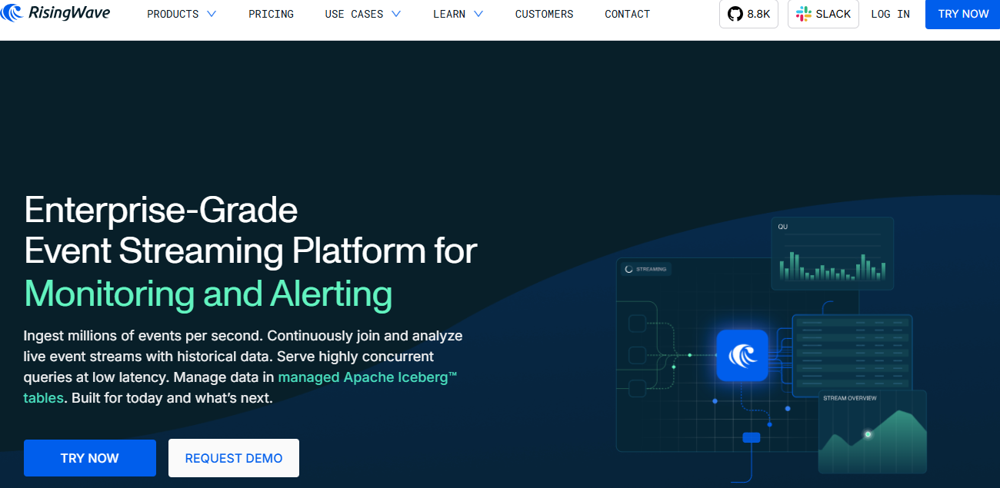
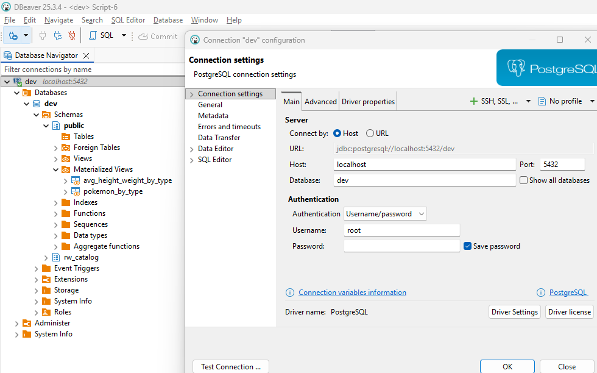
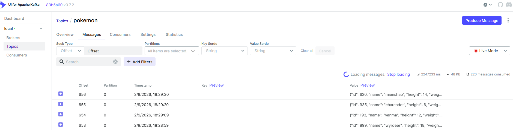
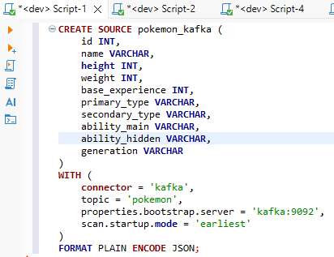
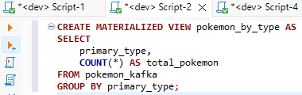
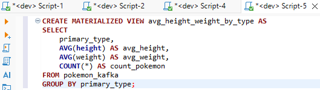
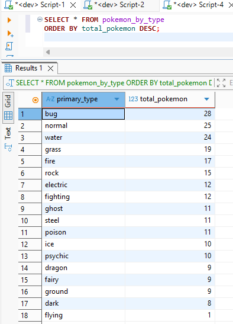
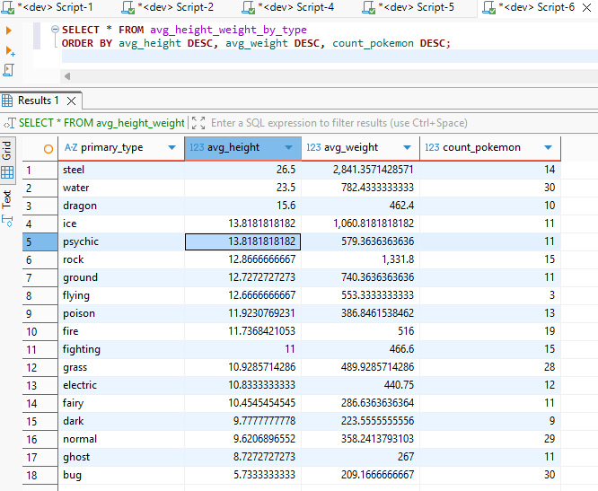

# RisingWave Project

RisingWave es una base de datos de *stream processing* en tiempo real basada en SQL.

RisingWave **implementa el protocolo de Kafka**, lo que significa que puede conectarse directamente a Kafka como un consumidor nativo. Esto le permite suscribirse a *topics*, gestionar particiones y offsets, y consumir eventos en tiempo real **sin necesidad de conectores externos ni herramientas intermedias**. Los datos fluyen directamente desde Kafka hacia RisingWave con baja latencia y una arquitectura simplificada.

Además, RisingWave **implementa el protocolo wire de PostgreSQL**, lo que implica que puede ser consultado usando clientes y herramientas estándar de PostgreSQL (como `psql`, DBeaver o PgAdmin). Para el usuario, interactuar con RisingWave es prácticamente igual que trabajar con una base de datos PostgreSQL tradicional, aunque internamente esté procesando flujos de datos en tiempo real.

El procesamiento se define de forma **declarativa mediante SQL**: los streams se modelan como tablas, y las transformaciones se expresan como consultas SQL persistentes. Las vistas materializadas se mantienen actualizadas automáticamente a medida que llegan nuevos eventos, sin necesidad de ejecutar jobs imperativos ni escribir código adicional.

Este proyecto demuestra cómo conectar Kafka con RisingWave para procesar datos en tiempo real usando SQL, combinando la potencia del streaming con la simplicidad y familiaridad del ecosistema PostgreSQL.

<p align="center"> 
   
</p>

## Contenedores del proyecto

Para la demo usamos los siguientes servicios:

| Servicio         | Propósito                                                                               |
| ---------------- | --------------------------------------------------------------------------------------- |
| Zookeeper        | Coordinador de Kafka                                                                    |
| Kafka            | Topic de eventos en tiempo real                                                         |
| Kafka UI         | Interfaz web para inspeccionar topics y mensajes                                        |
| init-kafka-topic | Script que crea el topic al que vamos a publicar mensajes                               |
| RisingWave       | Base de datos streaming SQL que consume Kafka y permite consultas en tiempo real        |
| Producer         | Script Python que publica eventos en Kafka cada cierto intervalo usando la API de Kafka |
| DBeaver          | Cliente SQL que se conecta a RisingWave para consultar fuentes y vistas                 |

## Docker Compose

Levantamos Kafka, Kafka UI, RisingWave y el productor de datos con un solo comando:

```bash
docker-compose up -d
```

* Kafka UI: [http://localhost:8080](http://localhost:8080)
* RisingWave UI: [http://localhost:5691](http://localhost:5691)
* RisingWave SQL endpoint compatible con PostgreSQL: `localhost:4566`

> RisingWave implementa el protocolo SQL compatible con PostgreSQL, lo que permite usar clientes SQL estándar, como DBeaver, para conectarse directamente a las fuentes y vistas en streaming. Esto significa que podemos ejecutar consultas SQL sobre datos que todavía están llegando desde Kafka, crear vistas y materialized views, y obtener resultados inmediatos sin necesidad de replicar los datos en otra base de datos.

## Conexión con DBeaver

Usamos DBeaver, un cliente SQL multiplataforma, para conectarnos al endpoint SQL de RisingWave usando los parámetros típicos de PostgreSQL: host `localhost`, puerto `4566`, usuario `root` (o el configurado).

<p align="center"> 
   
</p>

## Flujo de datos streaming

1. **Publicar eventos a Kafka**

   Usamos un script en Python (`pokemon-publisher`) que obtiene datos de la [PokéAPI](https://pokeapi.co/) y publica mensajes JSON al topic `pokemon`.

   <p align="center"> 
       
   </p>

2. **Crear la fuente en RisingWave**

   Esto crea un "canal" en streaming que siempre refleja los últimos mensajes de Kafka. La fuente se actualiza en tiempo real conforme llegan nuevos eventos.

   <p align="center"> 
       
   </p>

3. **Crear vistas y vistas materializadas**

   Una vista es una consulta dinámica que se ejecuta cada vez que la consultas, mientras que una vista materializada almacena los resultados y se actualiza automáticamente con los nuevos eventos, permitiendo consultas rápidas sin recalcular toda la lógica. Así pues, en esta demo usamos **materialized views** para agregar y analizar los Pokémon por tipo y generar estadísticas en tiempo real, garantizando que las consultas reflejen siempre los datos más recientes.

   * Pokémon agregados por tipo:

      <p align="center"> 
          
      </p>

   * Estadísticas por tipo:

      <p align="center"> 
          
      </p>

4. **Consultar las vistas**

<p align="center"> 
    
</p>

<p align="center"> 
    
</p>

## Conclusiones

RisingWave permite procesar datos en tiempo real usando SQL estándar sobre flujos de eventos, sin necesidad de replicarlos en otra base de datos. Con esta herramienta hemos podido:

* Conectarnos a Kafka y crear fuentes de datos en streaming.
* Construir materialized views que se actualizan automáticamente con los nuevos eventos.
* Ejecutar consultas SQL inmediatas sobre datos que aún están llegando, incluyendo agregaciones y análisis por ventana de tiempo.

RisingWave destaca por permitir análisis en tiempo real con mínima complejidad, ideal para transformar, agregar y visualizar datos en dashboards instantáneamente. Su compatibilidad con SQL y clientes PostgreSQL facilita la adopción por equipos acostumbrados a bases de datos tradicionales.

En comparación con otras herramientas de streaming como **Apache Flink**, Flink ofrece mayor flexibilidad en el manejo de ventanas, tolerancia a eventos tardíos y capacidades avanzadas de procesamiento distribuido. Por ejemplo, permite implementar lógica personalizada como detección de fraude o análisis de sesiones con ventanas deslizantes complejas. En cambio, RisingWave se centra en consultas SQL estándar y ventanas de tiempo comunes, suficientes para la mayoría de dashboards y métricas en tiempo real.

En resumen, RisingWave es ideal para prototipos, dashboards y análisis de datos en tiempo real con mínima complejidad operativa, incluyendo agregaciones y ventanas de tiempo comunes. Para flujos extremadamente complejos o con necesidades avanzadas de control sobre ventanas, tolerancia a eventos tardíos y lógica distribuida personalizada, Flink sigue siendo la opción más madura y potente.
